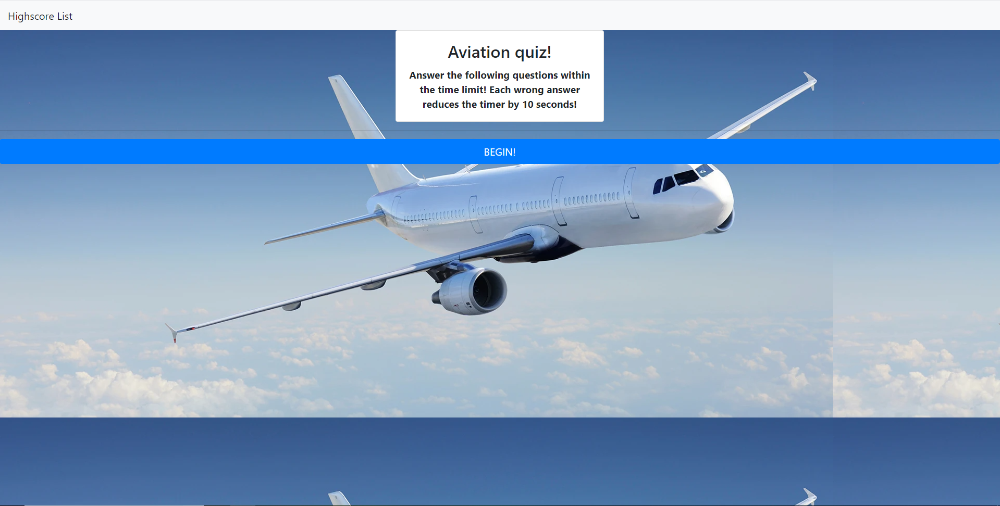

# CodeQuiz
Aviation Quiz Project
This quiz contains a few questions related to aviation. Click on the start button to test your aviation knowledge. The timer will start counting down and you must answer the questions before the timer runs out. If your answer is incorrect, 10 seconds will be deducted from your time! At the end of the game, the time remaining will be your score.

This project required pretty extensive knowledge of many aspects of JavaScript. It was very challenging using all sorts of dynamic elements that allow user input to change what occurs
on the quiz. I learned quite a bit while creating this aviation themed quiz. Tying together multiple html, css, and javascript files and making them work harmoniously was definitely a big challenge that I will need to work more on in the future. This was a very time consuming project for me and I will definitely be spending a bit more time at the onset of the following projects to better allocate my time! I did not complete a few of the objectives of this exercise. I ran out of time while starting work on the local storage. I will work in my offtime to finish it up. Thanks for looking!